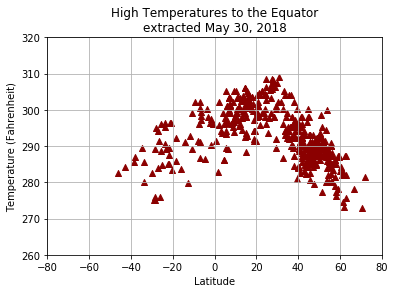
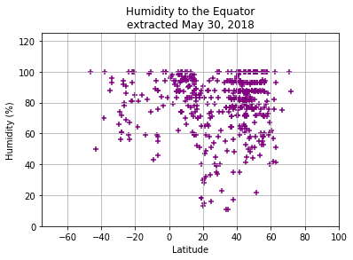
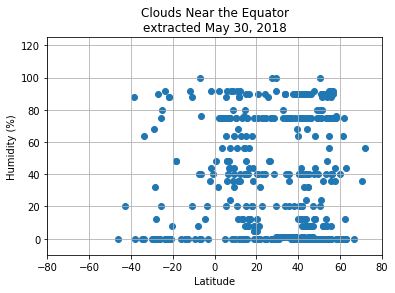
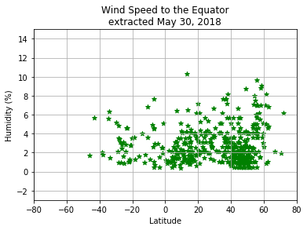

# WeatherPy 
### What's the weather like as we approach the equator?


```python
# Dependencies
import csv
import matplotlib.pyplot as plt
import json
import pandas as pd
import requests
from config import api_key
from citipy import citipy
import random
```

### Generate Cities List


```python
city_list =[]

places = citipy.WORLD_CITIES_DICT

for place in places:
    city = citipy.nearest_city(lat,lon)
    city_list.append(city.city_name)

cities = random.sample(city_list, 520)
```

### Save config information & build partial query URL


```python
url = "http://api.openweathermap.org/data/2.5/weather?"
units = "Imperial"
query_url = f"{url}?units={units}&appid={api_key}&q=" 
#print(query_url)
```

### Perform API calls


```python
city_name = []
latitude = []
max_temp = []
humidity = []
cloudiness = []
wind_speed = []
city_count = 0

print("Beginning Data Retrieval")
print("-------------------------------------------------")

for city in cities:
    try:
        response = requests.get(query_url + city).json()
        #print(response)
        city_name.append(response['name'])  
        latitude.append(response['coord']['lat'])
        max_temp.append(response['main']['temp_max'])     
        humidity.append(response['main']['humidity']) 
        cloudiness.append(response['clouds']['all']) 
        wind_speed.append(response['wind']['speed'])
        city_count = city_count+1
        print(f"Processing City #{city_count} | {city}")
        print(requests.get(query_url + city))
        #print(query_url + city)        
        
    except:
        #print(f"City not found. Skipping {city}")
        pass

print("-------------------------------------------------")       
print("Data Retrieval Complete")
print("-------------------------------------------------")
        
```

    Beginning Data Retrieval
    -------------------------------------------------
    Processing City #1 | bonaberi
    <Response [200]>
    Processing City #2 | sumabnit
    <Response [200]>
    Processing City #3 | qumaym
    <Response [200]>
    Processing City #4 | odaile
    <Response [200]>
    Processing City #5 | livingston
    <Response [200]>
    Processing City #6 | la concordia
    <Response [200]>
    Processing City #7 | gashua
    <Response [200]>
    Processing City #8 | anisoc
    <Response [200]>
    Processing City #9 | caraballeda
    <Response [200]>
    Processing City #10 | nikolskoye
    <Response [200]>
    Processing City #11 | olutanga
    <Response [200]>
    Processing City #12 | banganan
    <Response [200]>
    Processing City #13 | ragusa
    <Response [200]>
    Processing City #14 | voloka
    <Response [200]>
    Processing City #15 | ringsted
    <Response [200]>
    Processing City #16 | gargunnock
    <Response [200]>
    Processing City #17 | paez
    <Response [200]>
    Processing City #18 | narsingdi
    <Response [200]>
    Processing City #19 | halmeu
    <Response [200]>
    Processing City #20 | valle de banderas
    <Response [200]>
    Processing City #21 | el penol
    <Response [200]>
    Processing City #22 | springfield
    <Response [200]>
    Processing City #23 | kedungwuni
    <Response [200]>
    Processing City #24 | kingisepp
    <Response [200]>
    Processing City #25 | oga
    <Response [200]>
    Processing City #26 | hasanpur
    <Response [200]>
    Processing City #27 | oistins
    <Response [200]>
    Processing City #28 | dourbali
    <Response [200]>
    Processing City #29 | kostrzyn
    <Response [200]>
    Processing City #30 | fusagasuga
    <Response [200]>
    Processing City #31 | sinayawan
    <Response [200]>
    Processing City #32 | paracuru
    <Response [200]>
    Processing City #33 | messina
    <Response [200]>
    Processing City #34 | abomey-calavi
    <Response [200]>
    Processing City #35 | plauen
    <Response [200]>
    Processing City #36 | glamang
    <Response [200]>
    Processing City #37 | nageshwari
    <Response [200]>
    Processing City #38 | santa helena
    <Response [200]>
    Processing City #39 | stenlille
    <Response [200]>
    Processing City #40 | baganga
    <Response [200]>
    Processing City #41 | lennestadt
    <Response [200]>
    Processing City #42 | bacnotan
    <Response [200]>
    Processing City #43 | nueva germania
    <Response [200]>
    Processing City #44 | muggia
    <Response [200]>
    Processing City #45 | chukhloma
    <Response [200]>
    Processing City #46 | salamanca
    <Response [200]>
    Processing City #47 | lewisville
    <Response [200]>
    Processing City #48 | ponerihouen
    <Response [200]>
    Processing City #49 | ocana
    <Response [200]>
    Processing City #50 | buarcos
    <Response [200]>
    Processing City #51 | koryazhma
    <Response [200]>
    Processing City #52 | cantel
    <Response [200]>
    Processing City #53 | iguguno
    <Response [200]>
    Processing City #54 | anzio
    <Response [200]>
    Processing City #55 | dambovicioara
    <Response [200]>
    Processing City #56 | litomerice
    <Response [200]>
    Processing City #57 | jutiapa
    <Response [200]>
    Processing City #58 | luvianos
    <Response [200]>
    Processing City #59 | tilik
    <Response [200]>
    Processing City #60 | chipping sodbury
    <Response [200]>
    Processing City #61 | mildmay
    <Response [200]>
    Processing City #62 | cedar park
    <Response [200]>
    Processing City #63 | odolena voda
    <Response [200]>
    Processing City #64 | atlixco
    <Response [200]>
    Processing City #65 | oktyabrskoye
    <Response [200]>
    Processing City #66 | poindimie
    <Response [200]>
    Processing City #67 | matata
    <Response [200]>
    Processing City #68 | cheremkhovo
    <Response [200]>
    Processing City #69 | lakewood
    <Response [200]>
    Processing City #70 | ahuacatlan
    <Response [200]>
    Processing City #71 | erandio
    <Response [200]>
    Processing City #72 | taunton
    <Response [200]>
    Processing City #73 | san antonio
    <Response [200]>
    Processing City #74 | tonkino
    <Response [200]>
    Processing City #75 | optasi
    <Response [200]>
    Processing City #76 | makeni
    <Response [200]>
    Processing City #77 | grevena
    <Response [200]>
    Processing City #78 | kahta
    <Response [200]>
    Processing City #79 | lure
    <Response [200]>
    Processing City #80 | davydivka
    <Response [200]>
    Processing City #81 | lazi
    <Response [200]>
    Processing City #82 | bidar
    <Response [200]>
    Processing City #83 | colton
    <Response [200]>
    Processing City #84 | vocklabruck
    <Response [200]>
    Processing City #85 | hoctun
    <Response [200]>
    Processing City #86 | furao
    <Response [200]>
    Processing City #87 | le lamentin
    <Response [200]>
    Processing City #88 | morangis
    <Response [200]>
    Processing City #89 | ekazhevo
    <Response [200]>
    Processing City #90 | taytay
    <Response [200]>
    Processing City #91 | buxton
    <Response [200]>
    Processing City #92 | aneby
    <Response [200]>
    Processing City #93 | tantoyuca
    <Response [200]>
    Processing City #94 | nikko
    <Response [200]>
    Processing City #95 | margate
    <Response [200]>
    Processing City #96 | ceuta
    <Response [200]>
    Processing City #97 | tricase
    <Response [200]>
    Processing City #98 | saskylakh
    <Response [200]>
    Processing City #99 | ako
    <Response [200]>
    Processing City #100 | basse
    <Response [200]>
    Processing City #101 | volnoye
    <Response [200]>
    Processing City #102 | naruja
    <Response [200]>
    Processing City #103 | makrana
    <Response [200]>
    Processing City #104 | cincu
    <Response [200]>
    Processing City #105 | voula
    <Response [200]>
    Processing City #106 | baixa grande
    <Response [200]>
    Processing City #107 | travnik
    <Response [200]>
    Processing City #108 | anand
    <Response [200]>
    Processing City #109 | limot
    <Response [200]>
    Processing City #110 | pangpang
    <Response [200]>
    Processing City #111 | zaragoza
    <Response [200]>
    Processing City #112 | ara
    <Response [200]>
    Processing City #113 | fauvillers
    <Response [200]>
    Processing City #114 | passo fundo
    <Response [200]>
    Processing City #115 | amilly
    <Response [200]>
    Processing City #116 | roquetas de mar
    <Response [200]>
    Processing City #117 | nova vcelnice
    <Response [200]>
    Processing City #118 | stolberg
    <Response [200]>
    Processing City #119 | moundou
    <Response [200]>
    Processing City #120 | artemisa
    <Response [200]>
    Processing City #121 | ulmu
    <Response [200]>
    Processing City #122 | opwijk
    <Response [200]>
    Processing City #123 | callaway
    <Response [200]>
    Processing City #124 | lunas
    <Response [200]>
    Processing City #125 | anatoli
    <Response [200]>
    Processing City #126 | guayama
    <Response [200]>
    Processing City #127 | songkhla
    <Response [200]>
    Processing City #128 | kyakhulay
    <Response [200]>
    Processing City #129 | aranzazu
    <Response [200]>
    Processing City #130 | valkla
    <Response [200]>
    Processing City #131 | kyaikkami
    <Response [200]>
    Processing City #132 | pushkino
    <Response [200]>
    Processing City #133 | calafell
    <Response [200]>
    Processing City #134 | balabanovo
    <Response [200]>
    Processing City #135 | fadd
    <Response [200]>
    Processing City #136 | el castillo
    <Response [200]>
    Processing City #137 | sandila
    <Response [200]>
    Processing City #138 | verkhniy mamon
    <Response [200]>
    Processing City #139 | bao
    <Response [200]>
    Processing City #140 | mokrousovo
    <Response [200]>
    Processing City #141 | turcinesti
    <Response [200]>
    Processing City #142 | oyama
    <Response [200]>
    Processing City #143 | kocser
    <Response [200]>
    Processing City #144 | yazoo city
    <Response [200]>
    Processing City #145 | wote
    <Response [200]>
    Processing City #146 | sonari
    <Response [200]>
    Processing City #147 | cherryland
    <Response [200]>
    Processing City #148 | delta
    <Response [200]>
    Processing City #149 | sakai
    <Response [200]>
    Processing City #150 | tibagon
    <Response [200]>
    Processing City #151 | ashland
    <Response [200]>
    Processing City #152 | dukhovshchina
    <Response [200]>
    Processing City #153 | rancho palos verdes
    <Response [200]>
    Processing City #154 | vetovo
    <Response [200]>
    Processing City #155 | strzelce krajenskie
    <Response [200]>
    Processing City #156 | virarajendrapet
    <Response [200]>
    Processing City #157 | agua de dios
    <Response [200]>
    Processing City #158 | kirchberg
    <Response [200]>
    Processing City #159 | horsens
    <Response [200]>
    Processing City #160 | komatipoort
    <Response [200]>
    Processing City #161 | macduff
    <Response [200]>
    Processing City #162 | maniakoi
    <Response [200]>
    Processing City #163 | buenlag
    <Response [200]>
    Processing City #164 | dhidhdhoo
    <Response [200]>
    Processing City #165 | cumberland
    <Response [200]>
    Processing City #166 | ocotlan
    <Response [200]>
    Processing City #167 | holice
    <Response [200]>
    Processing City #168 | salimpur
    <Response [200]>
    Processing City #169 | duldurga
    <Response [200]>
    Processing City #170 | north ogden
    <Response [200]>
    Processing City #171 | lancaster
    <Response [200]>
    Processing City #172 | medina
    <Response [200]>
    Processing City #173 | vacszentlaszlo
    <Response [200]>
    Processing City #174 | malamote
    <Response [200]>
    Processing City #175 | binitinan
    <Response [200]>
    Processing City #176 | mirador
    <Response [200]>
    Processing City #177 | anjo
    <Response [200]>
    Processing City #178 | montorio al vomano
    <Response [200]>
    Processing City #179 | la marque
    <Response [200]>
    Processing City #180 | wuning
    <Response [200]>
    Processing City #181 | tinoto
    <Response [200]>
    Processing City #182 | kaset sombun
    <Response [200]>
    Processing City #183 | bry-sur-marne
    <Response [200]>
    Processing City #184 | nakambala
    <Response [200]>
    Processing City #185 | banff
    <Response [200]>
    Processing City #186 | wassenaar
    <Response [200]>
    Processing City #187 | gansing
    <Response [200]>
    Processing City #188 | totowa
    <Response [200]>
    Processing City #189 | zirgan
    <Response [200]>
    Processing City #190 | afikpo
    <Response [200]>
    Processing City #191 | diplo
    <Response [200]>
    Processing City #192 | zilina
    <Response [200]>
    Processing City #193 | goldenrod
    <Response [200]>
    Processing City #194 | caparrapi
    <Response [200]>
    Processing City #195 | fort smith
    <Response [200]>
    Processing City #196 | santo cristo
    <Response [200]>
    Processing City #197 | ilinskaya
    <Response [200]>
    Processing City #198 | siruguppa
    <Response [200]>
    Processing City #199 | san diego de la union
    <Response [200]>
    Processing City #200 | la union
    <Response [200]>
    Processing City #201 | libacao
    <Response [200]>
    Processing City #202 | spijkenisse
    <Response [200]>
    Processing City #203 | remagen
    <Response [200]>
    Processing City #204 | sao fidelis
    <Response [200]>
    Processing City #205 | diamantina
    <Response [200]>
    Processing City #206 | ravanusa
    <Response [200]>
    Processing City #207 | lubbock
    <Response [200]>
    Processing City #208 | bistra
    <Response [200]>
    Processing City #209 | melrose park
    <Response [200]>
    Processing City #210 | avramesti
    <Response [200]>
    Processing City #211 | olawa
    <Response [200]>
    Processing City #212 | donegal
    <Response [200]>
    Processing City #213 | tiszacsege
    <Response [200]>
    Processing City #214 | kostolac
    <Response [200]>
    Processing City #215 | novyye lyady
    <Response [200]>
    Processing City #216 | moldova sulita
    <Response [200]>
    Processing City #217 | mattoon
    <Response [200]>
    Processing City #218 | caramanta
    <Response [200]>
    Processing City #219 | barnova
    <Response [200]>
    Processing City #220 | haapsalu
    <Response [200]>
    Processing City #221 | schwalmtal
    <Response [200]>
    Processing City #222 | ladwa
    <Response [200]>
    Processing City #223 | vapnyarka
    <Response [200]>
    Processing City #224 | sedkyrkeshch
    <Response [200]>
    Processing City #225 | qujing
    <Response [200]>
    Processing City #226 | kriel
    <Response [200]>
    Processing City #227 | zaokskiy
    <Response [200]>
    Processing City #228 | quila
    <Response [200]>
    Processing City #229 | pine castle
    <Response [200]>
    Processing City #230 | prudentopolis
    <Response [200]>
    Processing City #231 | inhuma
    <Response [200]>
    Processing City #232 | tubli
    <Response [200]>
    Processing City #233 | vitry-sur-seine
    <Response [200]>
    Processing City #234 | wala
    <Response [200]>
    Processing City #235 | wonthaggi
    <Response [200]>
    Processing City #236 | senekal
    <Response [200]>
    Processing City #237 | izvoarele
    <Response [200]>
    Processing City #238 | mandaguari
    <Response [200]>
    Processing City #239 | kingsgate
    <Response [200]>
    Processing City #240 | nambalan
    <Response [200]>
    Processing City #241 | ypacarai
    <Response [200]>
    Processing City #242 | aubergenville
    <Response [200]>
    Processing City #243 | tetzoyocan
    <Response [200]>
    Processing City #244 | kabin buri
    <Response [200]>
    Processing City #245 | westborough
    <Response [200]>
    Processing City #246 | gonzales
    <Response [200]>
    Processing City #247 | ushi
    <Response [200]>
    Processing City #248 | posse
    <Response [200]>
    Processing City #249 | claremore
    <Response [200]>
    Processing City #250 | coolum beach
    <Response [200]>
    Processing City #251 | kozlovka
    <Response [200]>
    Processing City #252 | zabrat
    <Response [200]>
    Processing City #253 | bonbon
    <Response [200]>
    Processing City #254 | tha chang
    <Response [200]>
    Processing City #255 | sumbawanga
    <Response [200]>
    Processing City #256 | techirghiol
    <Response [200]>
    Processing City #257 | harnosand
    <Response [200]>
    Processing City #258 | stejari
    <Response [200]>
    Processing City #259 | kamen-na-obi
    <Response [200]>
    Processing City #260 | cardston
    <Response [200]>
    Processing City #261 | sieut
    <Response [200]>
    Processing City #262 | medzev
    <Response [200]>
    Processing City #263 | floriano
    <Response [200]>
    Processing City #264 | napierville
    <Response [200]>
    Processing City #265 | bicas
    <Response [200]>
    Processing City #266 | granada
    <Response [200]>
    Processing City #267 | meaford
    <Response [200]>
    Processing City #268 | natchitoches
    <Response [200]>
    Processing City #269 | oirschot
    <Response [200]>
    Processing City #270 | dhenkanal
    <Response [200]>
    Processing City #271 | ladyzhyn
    <Response [200]>
    Processing City #272 | gorgota
    <Response [200]>
    Processing City #273 | nea fokaia
    <Response [200]>
    Processing City #274 | capissayan
    <Response [200]>
    Processing City #275 | fairfield
    <Response [200]>
    Processing City #276 | irinjalakuda
    <Response [200]>
    Processing City #277 | mamurras
    <Response [200]>
    Processing City #278 | rafael lara grajales
    <Response [200]>
    Processing City #279 | polohy
    <Response [200]>
    Processing City #280 | alhama de murcia
    <Response [200]>
    Processing City #281 | puracic
    <Response [200]>
    Processing City #282 | roscommon
    <Response [200]>
    Processing City #283 | wausau
    <Response [200]>
    Processing City #284 | nefteyugansk
    <Response [200]>
    Processing City #285 | sura mare
    <Response [200]>
    Processing City #286 | cardona
    <Response [200]>
    Processing City #287 | chernenko
    <Response [200]>
    Processing City #288 | camp verde
    <Response [200]>
    Processing City #289 | louga
    <Response [200]>
    Processing City #290 | obosi
    <Response [200]>
    Processing City #291 | tecoman
    <Response [200]>
    Processing City #292 | bondy
    <Response [200]>
    Processing City #293 | pirassununga
    <Response [200]>
    Processing City #294 | hinsdale
    <Response [200]>
    Processing City #295 | natividad
    <Response [200]>
    Processing City #296 | el colorado
    <Response [200]>
    Processing City #297 | klyuchevskiy
    <Response [200]>
    Processing City #298 | tabuc
    <Response [200]>
    Processing City #299 | karitsa
    <Response [200]>
    Processing City #300 | chokurdakh
    <Response [200]>
    Processing City #301 | krasna
    <Response [200]>
    Processing City #302 | kadingilan
    <Response [200]>
    Processing City #303 | giera
    <Response [200]>
    Processing City #304 | rocafuerte
    <Response [200]>
    Processing City #305 | laurel
    <Response [200]>
    Processing City #306 | mungaoli
    <Response [200]>
    Processing City #307 | takanosu
    <Response [200]>
    Processing City #308 | paltinoasa
    <Response [200]>
    Processing City #309 | cromwell
    <Response [200]>
    Processing City #310 | bauta
    <Response [200]>
    Processing City #311 | bereznik
    <Response [200]>
    Processing City #312 | solon
    <Response [200]>
    Processing City #313 | malabor
    <Response [200]>
    Processing City #314 | ivanjica
    <Response [200]>
    Processing City #315 | banaba
    <Response [200]>
    Processing City #316 | san policarpo
    <Response [200]>
    Processing City #317 | lunca corbului
    <Response [200]>
    Processing City #318 | lauda-konigshofen
    <Response [200]>
    Processing City #319 | pavlovskaya sloboda
    <Response [200]>
    Processing City #320 | reque
    <Response [200]>
    Processing City #321 | tiszaszentimre
    <Response [200]>
    Processing City #322 | wakuya
    <Response [200]>
    Processing City #323 | luancheng
    <Response [200]>
    Processing City #324 | la herradura
    <Response [200]>
    Processing City #325 | pardubice
    <Response [200]>
    Processing City #326 | wasaga beach
    <Response [200]>
    Processing City #327 | temoac
    <Response [200]>
    Processing City #328 | tuatapere
    <Response [200]>
    Processing City #329 | anastasiyevskaya
    <Response [200]>
    Processing City #330 | gereykhanovskoye
    <Response [200]>
    Processing City #331 | capellen
    <Response [200]>
    Processing City #332 | spittal
    <Response [200]>
    Processing City #333 | zyukayka
    <Response [200]>
    Processing City #334 | rovaniemi
    <Response [200]>
    Processing City #335 | balotesti
    <Response [200]>
    Processing City #336 | chipaque
    <Response [200]>
    Processing City #337 | kon tum
    <Response [200]>
    Processing City #338 | calella
    <Response [200]>
    Processing City #339 | siddhapur
    <Response [200]>
    Processing City #340 | tezontepec
    <Response [200]>
    Processing City #341 | fot
    <Response [200]>
    Processing City #342 | itapecerica
    <Response [200]>
    Processing City #343 | tessenderlo
    <Response [200]>
    Processing City #344 | ikornnes
    <Response [200]>
    Processing City #345 | emiliano zapata
    <Response [200]>
    Processing City #346 | rochefort
    <Response [200]>
    Processing City #347 | huambo
    <Response [200]>
    Processing City #348 | spasskoye
    <Response [200]>
    Processing City #349 | lesu
    <Response [200]>
    Processing City #350 | gujan-mestras
    <Response [200]>
    Processing City #351 | seaca de camp
    <Response [200]>
    Processing City #352 | pilisszanto
    <Response [200]>
    Processing City #353 | karpushikha
    <Response [200]>
    Processing City #354 | baybay
    <Response [200]>
    Processing City #355 | stalpu
    <Response [200]>
    Processing City #356 | east hartford
    <Response [200]>
    Processing City #357 | cristobal obregon
    <Response [200]>
    Processing City #358 | naruto
    <Response [200]>
    Processing City #359 | lukang
    <Response [200]>
    Processing City #360 | centralina
    <Response [200]>
    Processing City #361 | karema
    <Response [200]>
    Processing City #362 | oer-erkenschwick
    <Response [200]>
    Processing City #363 | gyongyos
    <Response [200]>
    Processing City #364 | stubbekobing
    <Response [200]>
    Processing City #365 | soyaniquilpan
    <Response [200]>
    Processing City #366 | itirapina
    <Response [200]>
    Processing City #367 | lisov
    <Response [200]>
    Processing City #368 | bugembe
    <Response [200]>
    Processing City #369 | heliconia
    <Response [200]>
    Processing City #370 | almetyevsk
    <Response [200]>
    Processing City #371 | ellington
    <Response [200]>
    Processing City #372 | torrance
    <Response [200]>
    Processing City #373 | hauterive
    <Response [200]>
    Processing City #374 | suleja
    <Response [200]>
    Processing City #375 | moldova noua
    <Response [200]>
    Processing City #376 | sada
    <Response [200]>
    Processing City #377 | foeni
    <Response [200]>
    Processing City #378 | esparta
    <Response [200]>
    Processing City #379 | blackwood
    <Response [200]>
    Processing City #380 | barranca
    <Response [200]>
    Processing City #381 | caapora
    <Response [200]>
    Processing City #382 | carmen
    <Response [200]>
    Processing City #383 | jemnice
    <Response [200]>
    Processing City #384 | goruia
    <Response [200]>
    Processing City #385 | redcar
    <Response [200]>
    Processing City #386 | maple shade
    <Response [200]>
    Processing City #387 | changuinola
    <Response [200]>
    Processing City #388 | pielesti
    <Response [200]>
    Processing City #389 | el maranon
    <Response [200]>
    Processing City #390 | volnoye
    <Response [200]>
    Processing City #391 | greci
    <Response [200]>
    Processing City #392 | aberfeldy
    <Response [200]>
    Processing City #393 | runcorn
    <Response [200]>
    Processing City #394 | ladysmith
    <Response [200]>
    Processing City #395 | batu berendam
    <Response [200]>
    Processing City #396 | dobeln
    <Response [200]>
    Processing City #397 | stolbovaya
    <Response [200]>
    Processing City #398 | guindapunan
    <Response [200]>
    Processing City #399 | phoenixville
    <Response [200]>
    Processing City #400 | tsikalaria
    <Response [200]>
    Processing City #401 | moscow
    <Response [200]>
    Processing City #402 | maradi
    <Response [200]>
    Processing City #403 | ibirama
    <Response [200]>
    Processing City #404 | las palmas
    <Response [200]>
    Processing City #405 | namtsy
    <Response [200]>
    Processing City #406 | argostolion
    <Response [200]>
    Processing City #407 | romblon
    <Response [200]>
    Processing City #408 | putai
    <Response [200]>
    Processing City #409 | elsterwerda
    <Response [200]>
    Processing City #410 | kamareddi
    <Response [200]>
    Processing City #411 | novaya mayna
    <Response [200]>
    Processing City #412 | inhambane
    <Response [200]>
    Processing City #413 | portsoy
    <Response [200]>
    Processing City #414 | igny
    <Response [200]>
    Processing City #415 | acu
    <Response [200]>
    Processing City #416 | khadki
    <Response [200]>
    Processing City #417 | lloydminster
    <Response [200]>
    Processing City #418 | lubon
    <Response [200]>
    Processing City #419 | santa cruz
    <Response [200]>
    Processing City #420 | barsana
    <Response [200]>
    Processing City #421 | pavlovo
    <Response [200]>
    Processing City #422 | yozgat
    <Response [200]>
    Processing City #423 | springfield
    <Response [200]>
    Processing City #424 | bagneux
    <Response [200]>
    Processing City #425 | gostivar
    <Response [200]>
    Processing City #426 | gorbatovka
    <Response [200]>
    Processing City #427 | port lincoln
    <Response [200]>
    Processing City #428 | khndzoresk
    <Response [200]>
    Processing City #429 | ushtobe
    <Response [200]>
    Processing City #430 | harsum
    <Response [200]>
    Processing City #431 | meycauayan
    <Response [200]>
    Processing City #432 | newark
    <Response [200]>
    Processing City #433 | parga
    <Response [200]>
    Processing City #434 | pullman
    <Response [200]>
    Processing City #435 | katowice
    <Response [200]>
    Processing City #436 | krsko
    <Response [200]>
    Processing City #437 | bay-khaak
    <Response [200]>
    Processing City #438 | imphal
    <Response [200]>
    Processing City #439 | vittoria
    <Response [200]>
    Processing City #440 | langenburg
    <Response [200]>
    Processing City #441 | kanke
    <Response [200]>
    Processing City #442 | jarrow
    <Response [200]>
    Processing City #443 | chemainus
    <Response [200]>
    Processing City #444 | kalino
    <Response [200]>
    Processing City #445 | aleksandrovka
    <Response [200]>
    Processing City #446 | jugno
    <Response [200]>
    Processing City #447 | annapolis
    <Response [200]>
    Processing City #448 | barra dos coqueiros
    <Response [200]>
    Processing City #449 | sultanpur
    <Response [200]>
    Processing City #450 | lohja
    <Response [200]>
    Processing City #451 | farrukhabad
    <Response [200]>
    Processing City #452 | udpura
    <Response [200]>
    Processing City #453 | jundiai
    <Response [200]>
    Processing City #454 | ucar
    <Response [200]>
    Processing City #455 | kuba-taba
    <Response [200]>
    Processing City #456 | khardaha
    <Response [200]>
    Processing City #457 | kusadak
    <Response [200]>
    Processing City #458 | sarszentmihaly
    <Response [200]>
    Processing City #459 | ritchie
    <Response [200]>
    Processing City #460 | kirkintilloch
    <Response [200]>
    Processing City #461 | aligarh
    <Response [200]>
    Processing City #462 | vinstra
    <Response [200]>
    Processing City #463 | cogon
    <Response [200]>
    Processing City #464 | machhiwara
    <Response [200]>
    Processing City #465 | porto recanati
    <Response [200]>
    Processing City #466 | west columbia
    <Response [200]>
    Processing City #467 | daeni
    <Response [200]>
    Processing City #468 | khandwa
    <Response [200]>
    Processing City #469 | navotas
    <Response [200]>
    Processing City #470 | inagi
    <Response [200]>
    Processing City #471 | mount juliet
    <Response [200]>
    Processing City #472 | orocue
    <Response [200]>
    Processing City #473 | salmon creek
    <Response [200]>
    Processing City #474 | malacatan
    <Response [200]>
    Processing City #475 | las lajas
    <Response [200]>
    Processing City #476 | zmeyskaya
    <Response [200]>
    Processing City #477 | beriu
    <Response [200]>
    Processing City #478 | siria
    <Response [200]>
    Processing City #479 | breves
    <Response [200]>
    Processing City #480 | ouffet
    <Response [200]>
    Processing City #481 | hallein
    <Response [200]>
    Processing City #482 | kamien pomorski
    <Response [200]>
    Processing City #483 | sakura
    <Response [200]>
    Processing City #484 | storozhevaya
    <Response [200]>
    Processing City #485 | general jose eduvigis diaz
    <Response [200]>
    Processing City #486 | rosny-sous-bois
    <Response [200]>
    Processing City #487 | cedar city
    <Response [200]>
    Processing City #488 | smyshlyayevka
    <Response [200]>
    Processing City #489 | popesti-leordeni
    <Response [200]>
    -------------------------------------------------
    Data Retrieval Complete
    -------------------------------------------------
    

### Create dataframe and export to csv


```python
weather_dict = {
    "city": city_name,
    "lat": latitude,
    "max temp": max_temp,
    "humidity":humidity,
    "cloudiness":cloudiness,
    "wind speed":wind_speed
}
weather_data = pd.DataFrame(weather_dict)
weather_data.head() 
weather_data.to_csv("weather_data.csv",header=True,index = False)
```

### Temperature (F) vs. Latitude scatter plot


```python
plt.scatter(weather_data["lat"], weather_data["max temp"], marker="^",c="darkred")

plt.title("High Temperatures to the Equator\nextracted May 30, 2018")
plt.ylabel("Temperature (Fahrenheit)")
plt.xlabel("Latitude")
plt.grid(True)
plt.xlim([-80,80])
plt.ylim([260,320])

plt.savefig("TemperatureInWorldCities.png")

plt.show()
```





### Humidity (%) vs. Latitude scatter plot


```python
plt.scatter(weather_data["lat"], weather_data["humidity"], marker="+",c="purple")

plt.title("Humidity to the Equator\nextracted May 30, 2018")
plt.ylabel("Humidity (%)")
plt.xlabel("Latitude")
plt.grid(True)
plt.xlim([-75,100])
plt.ylim([0,125])

plt.savefig("HumidityInWorldCities.png")

plt.show()
```





### Cloudiness (%) vs. Latitude scatter plot


```python
plt.scatter(weather_data["lat"], weather_data["cloudiness"], marker="o")

plt.title("Clouds Near the Equator\nextracted May 30, 2018")
plt.ylabel("Humidity (%)")
plt.xlabel("Latitude")
plt.grid(True)
plt.xlim([-80,80])
plt.ylim([-10,125])

plt.savefig("CloudsInWorldCities.png")

plt.show()
```





### Wind Speed (mph) vs. Latitude scatter plot


```python
plt.scatter(weather_data["lat"], weather_data["wind speed"], marker="*",c="green")

plt.title("Wind Speed to the Equator\nextracted May 30, 2018")
plt.ylabel("Humidity (%)")
plt.xlabel("Latitude")
plt.grid(True)
plt.xlim([-80,80])
plt.ylim([-3,15])

plt.savefig("WindSpeedInWorldCities.png")

plt.show()
```





## Observations:
1. The cities with the highest temperatures are just north of the equator at 20 degree latitude.
2. Further north the city is located the humidity is higher. This could be due to the fact the data was pulled in May which is almost summer solstice.
3. Wind speed and cloudiness doesn't seem to be effected by equator.
